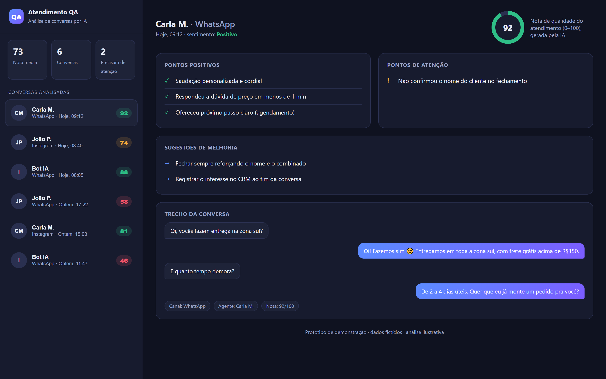
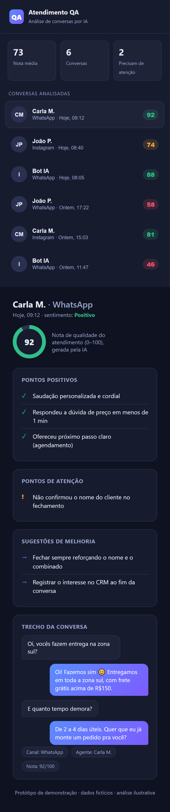
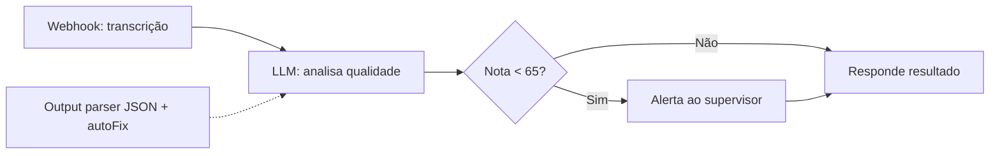

# Atendimento QA — análise de conversas por IA (protótipo)

Protótipo de uma ferramenta de **QA (garantia de qualidade) de atendimento**: ela lê conversas de
suporte/vendas (WhatsApp, Instagram, chat), usa um LLM para dar uma **nota de 0 a 100**, apontar
**pontos positivos, pontos de atenção e sugestões**, e **alertar um supervisor** quando a nota fica
baixa. Une um **front-end** de visualização a um **workflow n8n** que faz a análise.

> 🧪 **Protótipo de demonstração.** O front-end roda 100% offline com **conversas e notas fictícias**
> (`index.html`). O workflow n8n foi construído do zero, sem credenciais nem dados reais — é um
> exemplo de arquitetura, não um export de produção.

## Front-end

Painel com nota média, fila de conversas analisadas (com badge de nota) e, para cada uma: medidor de
nota, pontos positivos/atenção, sugestões de melhoria e o trecho da conversa. Responsivo (mobile):

## Workflow de análise (n8n)

[`workflows/analisa-conversa.json`](workflows/analisa-conversa.json) — recebe a transcrição por
webhook, analisa com um LLM e devolve um JSON estruturado (`score`, `sentimento`, `positivos`,
`negativos`, `sugestoes`). Usa **output parser com schema + autoFix** (JSON sempre válido) e um ramo
que **alerta o supervisor** quando a nota é baixa.

## O que demonstra

- **Integração de IA aplicada a um problema de negócio** (qualidade de atendimento).
- **Saída estruturada confiável** de um LLM (schema + autoFix), pronta pra alimentar UI/banco.
- **Loop de ação**: a análise não só mede — dispara alerta quando algo precisa de atenção.
- Front-end **data-driven** e responsivo, sem framework nem build.

## Stack

`HTML/CSS/JS` (front, sem build) · `n8n` + `OpenAI` (análise) · saída JSON com JSON Schema.

## Como rodar

- **Front-end:** abra o `index.html` no navegador.
- **Workflow:** importe o `.json` no n8n (Workflows → Import from File) e conecte sua credencial da OpenAI.

---
Feito por **Allan Thurler** — design + código.
📫 allanth.designer@gmail.com
